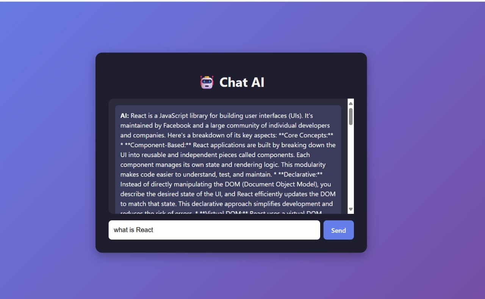
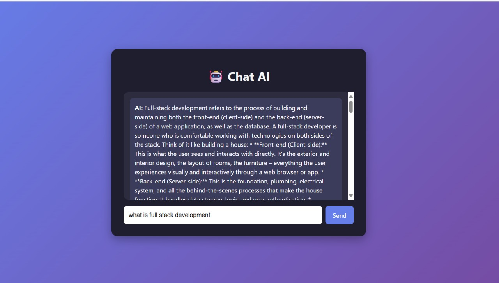

# **Chat-Bot built using Gemini-API-key**


🔗 **Deployed Link:** [Click Here](https://chat-bot-gemini-navy.vercel.app/)

A modern AI-powered chatbot built using **Next.js**, **React**, and **Gemini API**.  
This project demonstrates how to integrate a conversational AI model into a web application with a clean UI and efficient backend handling.

---

## 🚀 Features
- 🤖 AI-powered chatbot using Gemini API  
- ⚡ Built with **Next.js** for SSR and API routes  
- 🎨 Styled with **Tailwind CSS** for a modern look  
- 📱 Fully responsive design  
- 🔄 Real-time conversation handling  

---

## 📸 Screenshots

### Chat Interface


### Conversation Example


---

## 🛠️ Tech Stack
- **Frontend:** Next.js, React, Tailwind CSS  
- **Backend:** Next.js API Routes  
- **AI Model:** Gemini API  
- **Version Control:** Git & GitHub  

---

## 📦 Installation & Setup

1. Clone the repository:
   ```bash
   git clone https://github.com/your-username/chat-bot-gemini.git


   Install dependencies:

npm install


Create a .env.local file in the root and add your Gemini API key:

GEMINI_API_KEY=your_api_key_here


Run the development server:

npm run dev


Open http://localhost:3000
 in your browser.

🤝 Contributing

Contributions are welcome! Feel free to fork this repo, make changes, and submit a pull request.
